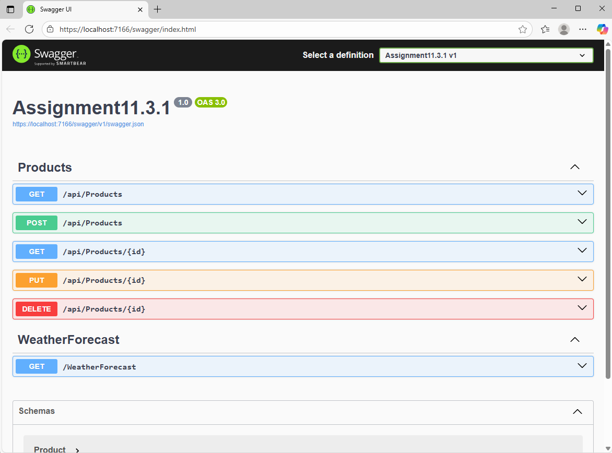
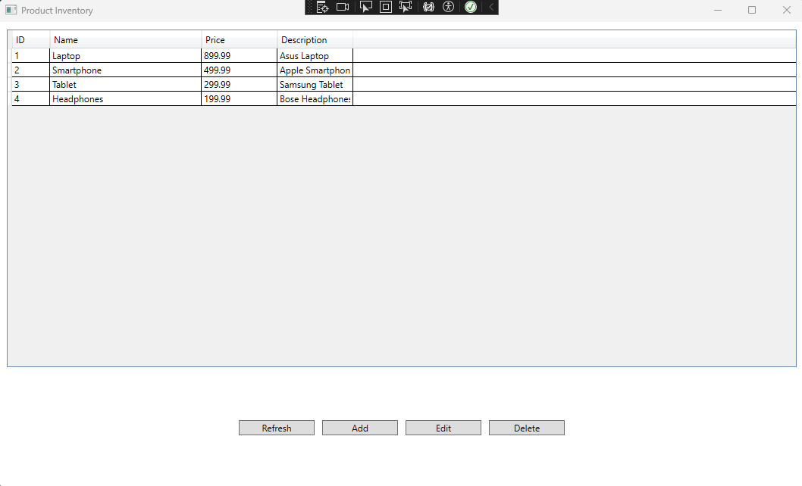
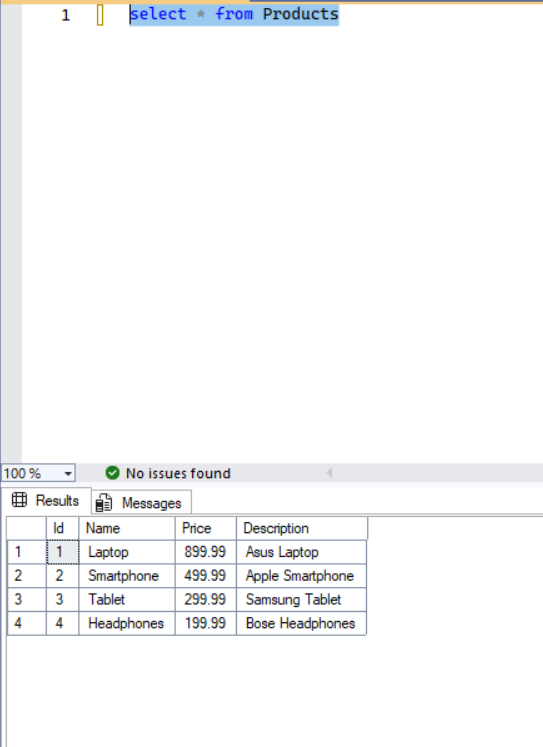
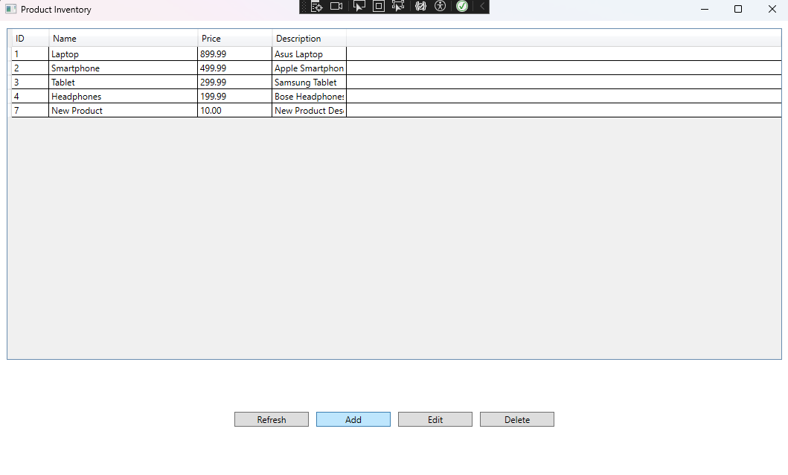
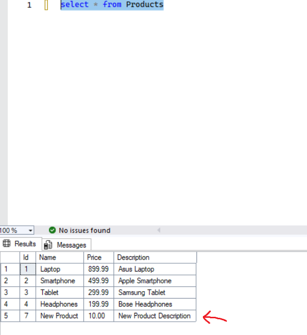
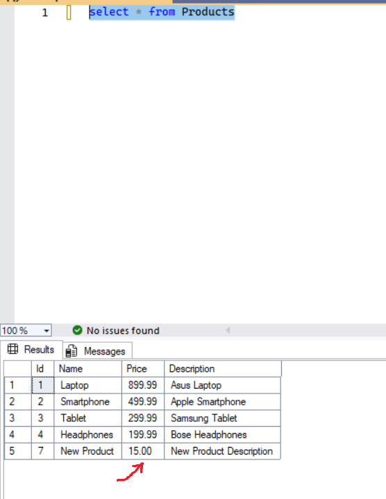
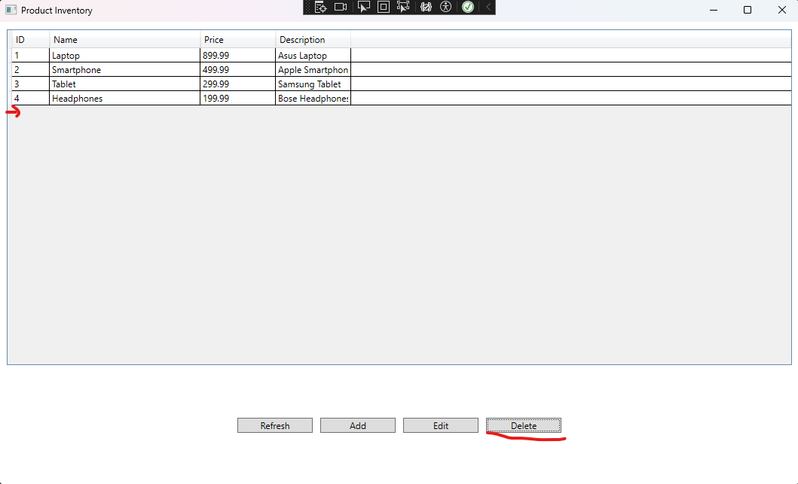
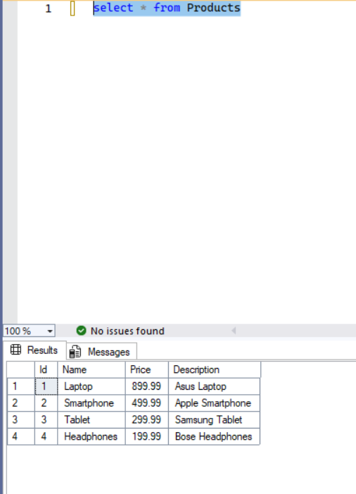

# Assignment11.3.1_Client

- A client application for Assignment 11.3.1
- Built with .NET 8.0 and C# 12.0

- CRUD operations for managing products

- Swagger UI for API testing
 

- WPF application for product inventory management
 

- SQL Server database integration
 

- Add new product
 

- New product added in SQL Server table
 

- Update existing product
 

- Updated product in SQL Server table
 

- Delete product
 

- Product deleted in SQL Server table
 
